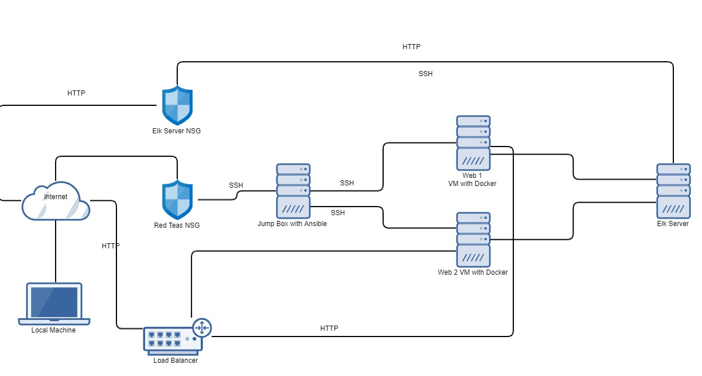

# Project-1
Cybersecurity Project 1 
## Automated ELK Stack Deployment

The files in this repository were used to configure the network depicted below.

These files have been tested and used to generate a live ELK deployment on Azure. They can be used to either recreate the entire deployment pictured above. Alternatively, select portions of the YAML file may be used to install only certain pieces of it, such as Filebeat.

ansible/filebeat_metricbeat-playbook.yml.txt

This document contains the following details:
- Description of the Topologu
- Access Policies
- ELK Configuration
  - Beats in Use
  - Machines Being Monitored
- How to Use the Ansible Build

### Description of the Topology

The main purpose of this network is to expose a load-balanced and monitored instance of DVWA, the D*mn Vulnerable Web Application.

Load balancing ensures that the application will be highly available, in addition to restricting inbound access to the network.

 - What aspect of security do load balancers protect? It protects against denial-of-service attacks
 - What is the advantage of a jump box? The jump box is exposed to the internet and behind it are the virtual machines which are not connected to the internet. The jump box allows connections to the virtual machines behind it from specific IP address

Integrating an ELK server allows users to easily monitor the vulnerable VMs for changes to the  file systems of the VMs on the network, as well as watch system metrics, such as CPU usage; attempted SSH logins; sudo escalation failures; etc.

- What does Filebeat watch for? Filebeat logs information about the file system including which files have changed and when.
- What does Metricbeat record? Metricbeat collects machine metrics such as uptime and CPU Usage.

The configuration details of each machine may be found below.

| Name        	| Function   	| IP Address 	| Operating System 	|
|-------------	|------------	|------------	|------------------	|
| Jump Box    	| Gateway    	| 10.0.0.4   	| Linux            	|
| Web-1       	| Webserver  	| 10.0.0.5   	| Linux            	|
| Web-2       	| Webserver  	| 10.0.0.6   	| Linux            	|
| ELK- Server 	| Mointoring 	| 10.1.0.4   	| Linux            	|

### Access Policies

The machines on the internal network are not exposed to the public Internet. 

Only the jump-box machine can accept connections from the Internet. Access to this machine is only allowed from the following IP addresses:
- 162.201.27.118

Machines within the network can only be accessed by each other.

- Web 1 and Web 2 are able to access the ELK VM. 

A summary of the access policies in place can be found in the table below.

| Name     | Publicly Accessible | Allowed IP Addresses |
|----------|---------------------|----------------------|
| Jump Box    	| Yes                	| 162.201.27.118       	|
| Web-1       	| No                 	| 10.0.0.4             	|
| Web-2       	| No                 	| 10.0.0.4             	|
| ELK- Server 	| No                 	| 10.0.0.4             	|

### Elk Configuration

Ansible was used to automate configuration of the ELK machine. No configuration was performed manually, which is advantageous because using anisble allows you to manage the entire network by updating Infrastrucite as code text file. 

The playbook implements the following tasks:
- Install Docker
- Install pip3
- Install Docker python module
- Increase vitual Memory
- Download and launch docker

The following screenshot displays the result of running `docker ps` after successfully configuring the ELK instance.

diagrams/Docker Screenshot.png

### Target Machines & Beats
This ELK server is configured to monitor the following machines:
- Web 1- 10.0.0.5  and Web 2 10.0.0.5

We have installed the following Beats on these machines:
- Filebeat and Metricbeat 

These Beats allow us to collect the following information from each machine:
- Filebeat detects changes to the filesystem. Specifically, we use it to collect Apache logs. Metricbeat detects changes in system metrics, such as CPU usage. We use it to detect SSH login attempts, failed sudo escalations, and CPU/RAM statistics.

### Using the Playbook

In order to use the playbook, you will need to have an Ansible control node already configured. Assuming you have such a control node provisioned: 

SSH into the control node and follow the steps below:
- Copy the install-elk.yml file to etc/ansible.
- Update the hosts file to include webservers
- Run the playbook, and navigate to http://51.120.78.209:5601/app/kibana to check that the installation worked as expected.
